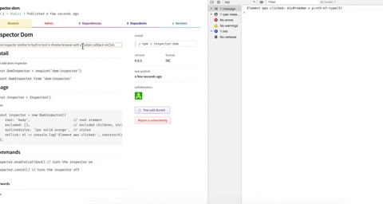

# Inspector Dom

Pure vanilla-js ultra-lightweight dom inspector similiar to built-in tool in chrome browser with a custom callback onClick.


## Install

### NPM
`npm i -s inspector-dom`

### Yarn
`yarn add inspector-dom`

## Usage


```js

import Inspector from 'inspector-dom';

const inspector = Inspector();
```

Props:

```javascript
const inspector = Inspector({
    root: 'body',                       // root element
    excluded: [],                       // excluded children, string or node Element
    outlineStyles: '2px solid orange',  // styles
    onClick: el => console.log('Element was clicked:', constructCssPath(el) //onClick callback
});
```

## API

```js
inspector.enable() // turn the inspector on

inspector.cancel() // turn the inspector off
```
